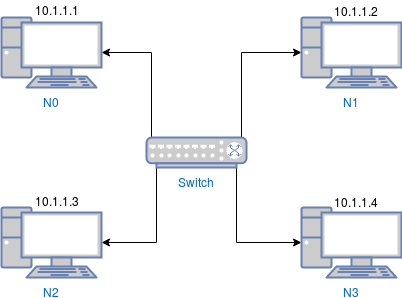

# Get started with OpenFlow in ns-3
## Download ns-3

If mercurial is installed on your system, you can download ns-3 directly:
```
hg clone http://code.nsnam.org/ns-3-dev
```

To obtain additional related libraries such as support for Python bindings, clone the ns-3-allinone repository as follows, and run the download.py program:
```
hg clone http://code.nsnam.org/ns-3-allinone
cd ns-3-allinone && ./download.py
```

## Configure ns-3
Change the current directory to ns-3-allinone and run the following: 
```
./build.py 
cd ns-3-dev
./waf configure --enable-examples --enable-tests
```

To run a sample program: 
```
./waf --run  first
```
 
## Enable OpenFlow

In order to use the OpenFlowSwitch module, you must create and link the OFSID (OpenFlow Software Implementation Distribution) to ns-3. To do this:

Obtain the OFSID code. An ns-3 specific OFSID branch is provided to ensure operation with ns-3. Use mercurial to download this branch and waf to build the library:
```
hg clone http://code.nsnam.org/openflow
cd openflow
```

From the openflow directory, run:
```
./waf configure
./waf build
```

Your OFSID is now built into a libopenflow.a library. To link to an ns-3 build with this OpenFlow switch module, run from ns-3-dev:
```
./waf configure --enable-examples --enable-tests --with-openflow=pathToOpenflow
```
where <code>pathToOpenflow</code> is something like <code>/home/joe019/7th\ sem/projects/openflow</code>

Under ---- Summary of optional NS-3 features: you should see:
```
"NS-3 OpenFlow Integration     : enabled"
```

indicating the library has been linked to ns-3. Run:
```
./waf build
```

to build ns-3 and activate the OpenFlowSwitch module in ns-3.

For an example demonstrating its use in a simple learning controller/switch, run:
```
./waf --run openflow-switch
```

To see it in detailed logging, run:
```
./waf --run "openflow-switch -v"
```

## Understanding openflow-switch.cc

```
#include <iostream>
#include <fstream>

#include "ns3/core-module.h"
#include "ns3/network-module.h"
#include "ns3/csma-module.h"
#include "ns3/internet-module.h"
#include "ns3/applications-module.h"
#include "ns3/openflow-module.h"
#include "ns3/log.h"
```
Every class exported by the ns3 library is enclosed in the ns3 namespace:
```
using namespace ns3;
```
```
NS_LOG_COMPONENT_DEFINE ("OpenFlowCsmaSwitchExample");

bool verbose = false;
bool use_drop = false;
ns3::Time timeout = ns3::Seconds (0);

bool SetVerbose (std::string value)
{
  verbose = true;
  return true;
}

bool SetDrop (std::string value)
{
  use_drop = true;
  return true;
}

bool SetTimeout (std::string value)
{
  try 
  {
      timeout = ns3::Seconds (atof (value.c_str ()));
      return true;
  }
  catch (...) 
  { 
   	  return false; 
  }
  return false;
}

int main (int argc, char *argv[])
{
  #ifdef NS3_OPENFLOW
```
Allow the user to override any of the defaults via command-line arguments:
```
  CommandLine cmd;
  cmd.AddValue ("v", "Verbose (turns on logging).", MakeCallback (&SetVerbose));
  cmd.AddValue ("verbose", "Verbose (turns on logging).", MakeCallback (&SetVerbose));
  cmd.AddValue ("d", "Use Drop Controller (Learning if not specified).", MakeCallback (&SetDrop));
  cmd.AddValue ("drop", "Use Drop Controller (Learning if not specified).", MakeCallback (&SetDrop));
  cmd.AddValue ("t", "Learning Controller Timeout (has no effect if drop controller is specified).", MakeCallback ( &SetTimeout));
  cmd.AddValue ("timeout", "Learning Controller Timeout (has no effect if drop controller is specified).", MakeCallback ( &SetTimeout));

  cmd.Parse (argc, argv);
```
```
  if (verbose)
    {
      LogComponentEnable ("OpenFlowCsmaSwitchExample", LOG_LEVEL_INFO);
      LogComponentEnable ("OpenFlowInterface", LOG_LEVEL_INFO);
      LogComponentEnable ("OpenFlowSwitchNetDevice", LOG_LEVEL_INFO);
    }
```
Explicitly create the nodes required by the topology:

NodeContainer -> Keeps track of a set of node pointers

Create (n) -> Create n nodes and append pointers to them to the end of a NodeContainer
```
  NS_LOG_INFO ("Create nodes.");
  NodeContainer terminals;
  terminals.Create (4);
```
```
  NodeContainer csmaSwitch;
  csmaSwitch.Create (1);

  NS_LOG_INFO ("Build Topology");
```
CsmaHelper -> Build a set of CsmaNetDevice objects 
```
  CsmaHelper csma;
  csma.SetChannelAttribute ("DataRate", DataRateValue (5000000));
  csma.SetChannelAttribute ("Delay", TimeValue (MilliSeconds (2)));
```
Create the csma links, from each terminal to the switch:
```
  NetDeviceContainer terminalDevices;
  NetDeviceContainer switchDevices;
  for (int i = 0; i < 4; i++)
    { 
      NetDeviceContainer link = csma.Install (NodeContainer (terminals.Get (i), csmaSwitch));
      terminalDevices.Add (link.Get (0));
      switchDevices.Add (link.Get (1));
    }
```
Create the switch netdevice, which will do the packet switching:
```
  Ptr<Node> switchNode = csmaSwitch.Get (0);
```
```
  OpenFlowSwitchHelper swtch;

  if (use_drop)
    {
      Ptr<ns3::ofi::DropController> controller = CreateObject<ns3::ofi::DropController> ();
      swtch.Install (switchNode, switchDevices, controller);
    }
  else
    {
      Ptr<ns3::ofi::LearningController> controller = CreateObject<ns3::ofi::LearningController> ();
      if (!timeout.IsZero ()) controller->SetAttribute ("ExpirationTime", TimeValue (timeout));
      swtch.Install (switchNode, switchDevices, controller);
    }
```
Add internet stack to the terminals:

InternetStackHelper -> Aggregate IP/TCP/UDP functionality to existing Nodes
```
  InternetStackHelper internet;
  internet.Install (terminals);
```
We've got the "hardware" in place; Now add IP addresses:
```
  NS_LOG_INFO ("Assign IP Addresses.");
  Ipv4AddressHelper ipv4;
  ipv4.SetBase ("10.1.1.0", "255.255.255.0");
  ipv4.Assign (terminalDevices);
```

Create an OnOff application to send UDP datagrams from n0 to n1:
```
  NS_LOG_INFO ("Create Applications.");
  uint16_t port = 9;  
  
  OnOffHelper onoff ("ns3::UdpSocketFactory",
                     Address (InetSocketAddress (Ipv4Address ("10.1.1.2"), port)));
  onoff.SetConstantRate (DataRate ("500kb/s"));
  
  ApplicationContainer app = onoff.Install (terminals.Get (0));
```
Start the application:
```
  app.Start (Seconds (1.0));
  app.Stop (Seconds (10.0));
```
Create an optional packet sink to receive these packets:
```
  PacketSinkHelper sink ("ns3::UdpSocketFactory",
                         Address (InetSocketAddress (Ipv4Address::GetAny (), port)));
  app = sink.Install (terminals.Get (1));
  app.Start (Seconds (0.0));
```
Create a similar flow from n3 to n0, starting at time 1.1 seconds:
```
  onoff.SetAttribute ("Remote",
                      AddressValue (InetSocketAddress (Ipv4Address ("10.1.1.1"), port)));
  app = onoff.Install (terminals.Get (3));
  app.Start (Seconds (1.1));
  app.Stop (Seconds (10.0));

  app = sink.Install (terminals.Get (0));
  app.Start (Seconds (0.0));
```
```
  NS_LOG_INFO ("Configure Tracing.");
```
Configure tracing of all enqueue, dequeue, and NetDevice receive events:

Trace output will be sent to the file "openflow-switch.tr"
```
  AsciiTraceHelper ascii;
  csma.EnableAsciiAll (ascii.CreateFileStream ("openflow-switch.tr"));
```
Configure some tcpdump traces. Each interface will be traced. The output files will be named:

   openflow-switch-nodeId-interfaceId.pcap 
   
and can be read by the "tcpdump -r" command (use "-tt" option to display timestamps correctly)
```
  csma.EnablePcapAll ("openflow-switch", false);
```
Now, do the actual simulation:
```
  NS_LOG_INFO ("Run Simulation.");
  Simulator::Run ();
  Simulator::Destroy ();
  NS_LOG_INFO ("Done.");
  #else
  NS_LOG_INFO ("NS-3 OpenFlow is not enabled. Cannot run simulation.");
  #endif // NS3_OPENFLOW
}
```
